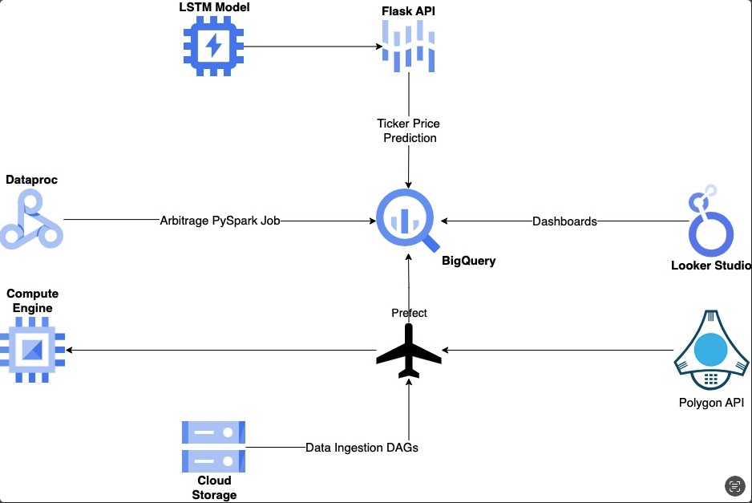
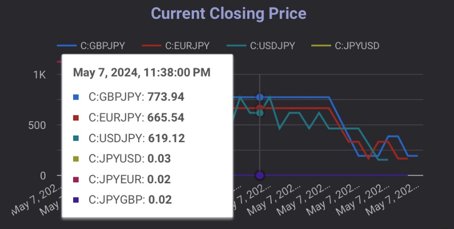
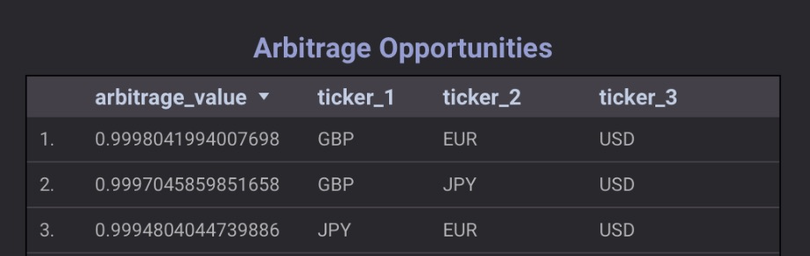
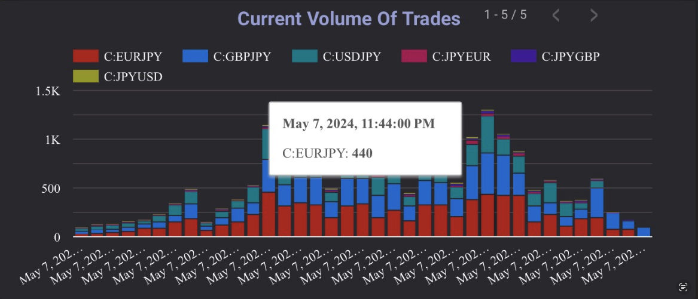

# Real Time Forex Arbitrage Detection and Price Prediction

This project presents a comprehensive system for real-time detection of forex arbitrage opportunities and price prediction. Designed to streamline the decision-making process in forex trading, the system leverages cutting-edge technologies and machine learning models to analyze and predict forex price movements accurately, enabling traders to capitalize on arbitrage opportunities swiftly.

Key Features

- **Real-Time Arbitrage Detection**: Utilizes Apache Spark to process live data streams, performing complex arbitrage calculations to identify profitable trading opportunities as they arise.
- **Price Prediction Model**: Employs a bi-directional LSTM neural network, trained to forecast future forex prices with high accuracy, allowing traders to make informed decisions based on predictive insights.
- **Data Handling and Storage**: Integrates Google BigQuery for robust and scalable storage of transactional data, ensuring efficient management and retrieval of large volumes of financial data.
- **Workflow Automation**: Orchestrates data processing workflows using a combination of Apache Airflow, Prefect, and Google Cloud Dataproc, which schedules and manages jobs efficiently to maintain optimal flow of data.
- **Real-Time Dashboard**: Features a dynamic dashboard developed in Looker Studio, offering users real-time insights into market trends and arbitrage opportunities through visually engaging and interactive data visualizations.

Technologies Used

- **Data Processing and Calculations**: Apache Spark
- **Data Storage**: Google BigQuery
- **Workflow Scheduling**: Apache Airflow, Prefect, Google Cloud Dataproc
- **Machine Learning Model**: Bi-directional LSTM
- **Model Deployment**: Flask
- **Data Visualization**: Looker Studio

Project Impact

This system provides a significant advantage to forex traders by automating the detection of arbitrage opportunities and predicting future price movements. It not only enhances the efficiency of trading strategies but also supports rapid decision-making, backed by data-driven insights.

## System Architecture

## Real Time Dashboard Created on Looker Studio 

